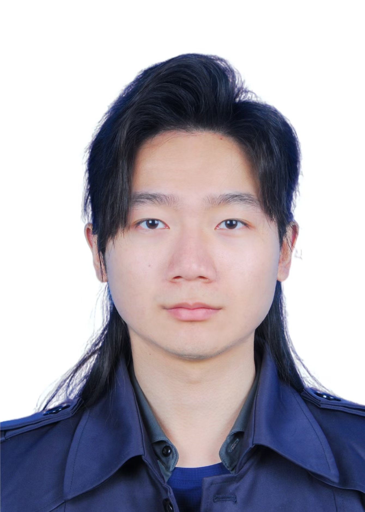

# Hongsong Tang (唐洪松)

Co-author, *World Commander*. Game-AI Application Researcher (游戏AI应用研究员) at
Tencent Timi Studio (腾讯天美工作室, the *Honor of Kings* studio). Joined the program
2026-06-19. Contact: ozpintang@tencent.com.

## Biography

Hongsong Tang received the B.S. and Ph.D. degrees from the Beijing University of Posts
and Telecommunications (BUPT), Beijing, China, in 2020 and 2025, respectively. His
research interests include reinforcement learning, large language models, distributed
systems, and game theory.
