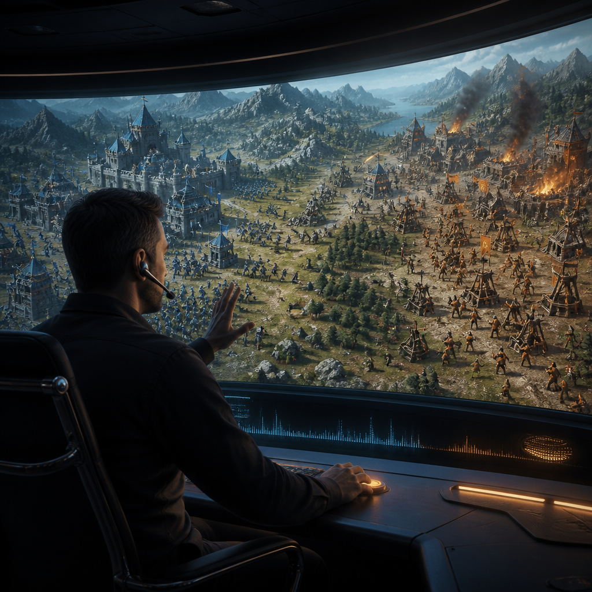
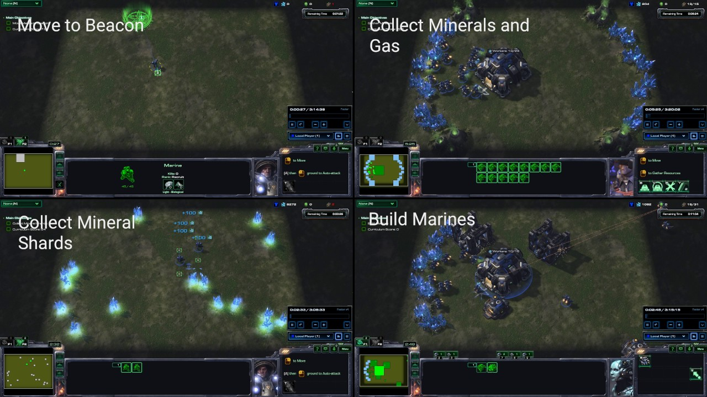
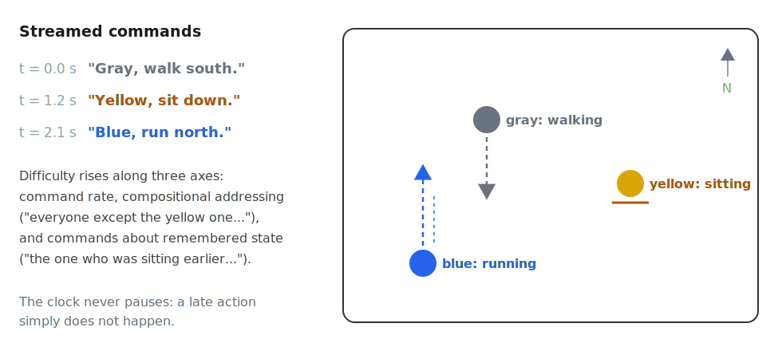
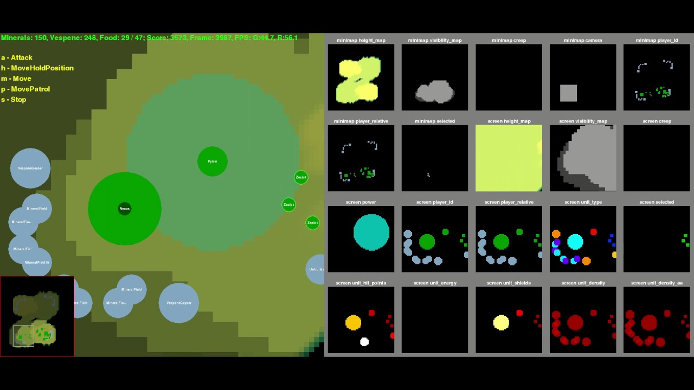

<!-- _class: title -->
<!-- _paginate: false -->

# Real-Time Crowd Commander

Natural-language command of agent crowds in strategy games, under real-time compute budgets

Real-time strategy games bury their best part, the strategy, under hundreds of manual actions a minute. This agenda asks whether the player can instead command in natural language, like a real commander, while a language model turns the orders into actions at game speed. The hard part is cost: what command takes in latency and memory under a clock that never pauses.

How much does natural-language command cost at game speed, and how can that cost be driven down?

A project proposal grown from Yubo Huang's interest and insight, under the guidance of Dr. Enmao Diao.

June 2026

---

<!-- _class: tight -->
# The Idea: Play the Strategy, Not the Mouse

I play real-time strategy games: Age of Empires IV, StarCraft II. The decision-making is the fun part: where to expand, when to attack, how to read the opponent.

But that thinking is buried under frantic manual labour: hunting for unit icons, drag-selecting, clicking hundreds of times a minute. The interface, not the strategy, is where the effort goes.

A strategy player should command the way a real commander does:

- **watch** the battle and **listen** to reports,
- **think**,
- **speak** the orders, pressing a key only now and then.

Subordinates handle the execution. That interface could be the next revolutionary strategy game.

<strong>Figure 1: the labour the interface forces.</strong> A montage of StarCraft II tasks: move here, gather there, build these. Age of Empires IV plays differently but shares the trait, rich strategy buried under hundreds of manual actions a minute.

Still: PySC2 video (DeepMind)

---

# The Missing Piece: Speed

The commander interface is not a new dream. It shipped once: [Tom Clancy's EndWar (2008)](https://en.wikipedia.org/wiki/Tom_Clancy's_EndWar) was a fully voice-commanded strategy game. But it ran on a rigid 70-word grammar: players had to memorize exact phrases, and anything outside the script failed.

Language models removed that limit. They understand free-form commands. What they cannot yet do is **act at game pace**: a model that takes seconds to answer is useless against an opponent moving every frame.

So the one missing piece is speed, and it sets the research question:

> **How much does natural-language command cost, in latency and memory, at game speed, and how can that cost be driven down?**

Everything is judged one way: **performance as a function of latency budget and memory budget**, an efficiency frontier rather than a single score. The clock never pauses, so a decision that arrives late simply does not happen.

---

<!-- _class: tight -->
# The Gap: Efficiency, Untested Where It Counts

LLMs can already play real-time strategy through a text interface: [TextStarCraft II (NeurIPS 2024)](https://arxiv.org/abs/2312.11865) beats the built-in AI. But systems like it slow or pause the clock to think, so the real-time question is sidestepped, not answered.

And the methods that would make real time possible are tested in the wrong place. Take **KV-cache eviction** (dropping old context to fit a memory budget): it is scored on perplexity and document retrieval, never inside a live game, where evicting the wrong memory, the opponent's scouted tech switch, loses the match minutes later, with no perplexity number to warn you.

**The gap, in one line**: a streaming game is the most natural stress test for efficient inference, and nobody has run it. Context grows every second, old information matters unevenly, and the ground-truth metric, win or lose, is external and unforgiving.

The field already feels the pressure: the [LLM Game Agents Survey (CSUR 2026)](https://arxiv.org/abs/2404.02039) names low-latency control as a core open challenge. The opening is visible to everyone.

---

# The Three Jobs

The system needs three capabilities. They are separate lines of work that will run together in the end, and all three share one yardstick: performance as a function of latency and memory budget.

| Job | What it does |
|---|---|
| **Decide** | An LLM commander reads the game-state stream and issues the orders, under hard latency and memory budgets |
| **Foresee** | A compact world model answers "what if" before you commit: if the army pushes now, does the fight win? |
| **Embody** | Units carry out the orders with model-generated motion (synthesized for the command, not replayed clips) at crowd scale on one GPU |

This proposal is about the first job, **Decide**. Foresee and Embody are the growth surface, built later.

---

<!-- _class: tight -->
# The Plan: Three Phases

The three jobs are the *parts*. The three phases are the *order*: we build in increasingly complex environments, with one shared **harness** under all of them (the command protocol, the unpausable clock, deadline enforcement, metric logging), so the engineering transfers upward.

| Phase | Focus | What happens |
|---|---|---|
| **Phase 1** | Benchmarks | Build the harness and the efficiency-frontier evaluation, on two testbeds: a command arena (warm-up) and StarCraft II with the clock unpaused (the flagship). |
| **Phase 2** | Methods | Attack whatever Phase 1 exposes as the bottleneck: game-aware eviction, a learned state tokenizer, distilled commanders. |
| **Phase 3** | The real interface | Bring in the human (voice), then humans plural (multiplayer competition); grow the Foresee and Embody jobs. |

The environments grow with the phases: **a toy room → StarCraft II → multiplayer → a full game.** The end-state game is the north star, not a deliverable: its role is to fix the two constraints every paper inherits, an unpausable clock and a hard compute budget.

---

# The Command Arena: Where Phase 1 Begins

<strong>Figure 2: Phase 1's warm-up testbed.</strong> Colour-tagged agents in a room, each command colour-keyed to its agent. One command is trivially easy for any modern model, by design: the test is the stream. Difficulty rises with command rate, with compositional orders ("everyone except the yellow one, gather at the door"), and with orders that depend on memory ("the one who was sitting earlier, move west"). It costs weeks, not months, and proves out the harness everything later reuses.

---

<!-- _class: tight -->
# Phase 1: the StarCraft II Benchmark

The flagship of Phase 1, the **wedge**: a deliberately narrow, fast first paper that splits the agenda open. It asks: can an LLM command at game speed, and which efficiency techniques preserve its judgment?

**The setup.** Build on the TextStarCraft II stack, but never pause the clock. Every decision carries a wall-clock deadline; the model runs under a fixed memory ceiling. A late decision does not happen.

**What varies.** The cache policy (full cache vs. methods like [StreamingLLM](https://arxiv.org/abs/2309.17453) sinks or [OBCache (ICML 2026)](https://arxiv.org/abs/2510.07651)); model size and sparsity (1B to 70B, pruned, quantized); the architecture; and how game state is encoded.

**What we measure.** Win rate as a function of latency budget and memory budget. The headline result is a frontier, not one number.

**The clever part: strategic-memory probes.** Scripted matches winnable only by recalling something seen minutes earlier. They turn an invisible cache mistake into a visible lost game, a report card no perplexity benchmark can give.

---

<!-- _class: tight -->
# The Key Bet: Slow Thinker, Fast Actors

The benchmark's most interesting question is architectural: should one big model do everything, or should a slow strategic **commander** direct fast, small **executors**?

Two independent clues say the split wins:

- A [1.3M-parameter specialist](https://arxiv.org/abs/2604.07385) decides a real-time game in 31 ms, while models up to 92,000 times larger miss the deadline. Small and fast can hold the clock.
- Robotics found the same shape: [π0 (2024)](https://arxiv.org/abs/2410.24164) pairs a slow vision-language brain with a fast action module running at 50 Hz. A game is a cheaper, safer place to test the idea.

A second bet: game state is not really text, it is entities, positions, and events (Figure 3). Rather than writing it out as prose, learn a compact code for it, the way [recent work (ICLR 2026)](https://www.diaoenmao.com) tokenizes graphs. A smaller state code shrinks every cost downstream.

<strong>Figure 3: game state is not text.</strong> PySC2 exposes StarCraft II as entity and terrain layers (right grid). Serializing this to prose is the naive baseline a learned tokenizer competes against.

Still: PySC2 video (DeepMind)

---

<!-- _class: tight -->
# What This Produces

The agenda is research-first: the game is the north star, the papers are the milestones. Each must answer a question its community already cares about, while caring nothing about the game.

| Paper | Phase | The question it answers | Who cares, beyond the game |
|---|---|---|---|
| Command-arena benchmark | 1 | How does grounding degrade as command rate rises? | Real-time agent and interactive-systems researchers |
| Real-time commander benchmark (the wedge) | 1 | Which efficiency methods survive a closed-loop game clock? | KV-cache and pruning researchers, whose methods are never scored by win rate |
| Game-state tokenizer | 1 to 2 | Does compact tokenization extend to entity and event streams? | The tokenization-beyond-text programme |
| Competitive-efficiency study | 3 | Does a fast small commander beat a slow large one? | Inference-efficiency and agents communities |
| Crowd motion under budget | 3 | Can language-commanded crowds move in real time on one GPU? | Motion-generation and graphics community |

---

<!-- _class: tight -->
# Why Now, Why Us, What's Next

**Why now.** The opening is public, and the [TextStarCraft II](https://arxiv.org/abs/2312.11865) group, who already own the infrastructure, are the obvious ones to fill it. A benchmark that arrives second is just a worse copy. The first paper rewards being first over being perfect.

**Why this pairing.** The wedge needs two scarce things at once: deep efficiency methods (cache eviction, structured pruning, tokenization beyond text), which Dr. Diao's recent work supplies, and benchmark engineering with genuine RTS fluency. Interface groups lack the efficiency depth; efficiency groups test on static corpora. That combination is the niche.

**To discuss together.**

- **Scope of the first paper**: the benchmark alone, or the benchmark plus the learned state tokenizer, the boldest methods bet?
- **The compute envelope**: the frontier sweep multiplies models, budgets, and matches; what scale is realistic on our GPUs?
- **Beyond the paper**: is the commander interface a DreamSoul product direction, or a pure research line?

Full proposal, decisions log, and this deck: <code>DreamSoul-AI/game-commander</code>.

