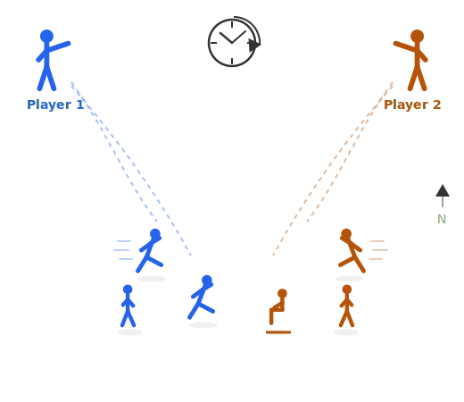

<!-- _class: title -->
<!-- _paginate: false -->

# World Commander

Natural-language command of agent crowds in strategy games, under real-time compute budgets

This proposal grew from Yubo Huang's interest and insight, under the guidance of Dr. Enmao Diao.

What we build: real-time, language-commanded agent crowds (here, two players commanding their own).

The long-term goal: the next revolutionary video game, played by voice from the commander's chair.

June 2026

---

<!-- _class: tight -->
# 1 Related Work: Efficiency, Untested at Game Speed

- The interface shipped once ([Tom Clancy's EndWar (2008)](https://en.wikipedia.org/wiki/Tom_Clancy's_EndWar)), but on a 70-word grammar. Language models lifted that limit; they still **cannot act at game pace**.
- LLMs already play StarCraft II, by text ([TextStarCraft II (NeurIPS 2024)](https://arxiv.org/abs/2312.11865)) or screenshots ([AVA (2026)](https://arxiv.org/abs/2503.05383)), but only by **pausing or slowing the clock**.
- Real-time is only now being measured ([VideoGameBench (2025)](https://arxiv.org/abs/2505.18134): models collapse once the clock keeps running), and only for single agents, **not the efficiency methods**.
- Eviction, quantization, and distillation are tuned on perplexity, where they already drop the wrong instruction ([Pitfalls of KV Cache Compression (ACL 2026)](https://arxiv.org/abs/2510.00231)); none is **scored by win rate in a live RTS**, where that lost context loses the match.

> How much does command cost, in latency and memory, at game speed, and how do we drive it down?

---

<!-- _class: tight -->
# 2 Preliminaries

The background this work builds on:

| Area | What it gives us |
|---|---|
| **Reinforcement learning** | A game is a Markov decision process: an agent acts, and win rate is the reward. We need to *understand* this to read the field; the work runs models by prompting, training none of its own. |
| **Efficient LLM inference** | KV-cache eviction (H2O, SnapKV, StreamingLLM, [OBCache](https://arxiv.org/abs/2510.07651)), structured pruning, quantization, distillation: the methods this work puts to the test. |
| **Vision-language-action models** | [π0](https://arxiv.org/abs/2410.24164): a slow vision-language backbone driving a fast action expert, trained by imitation. A model for splitting a slow strategic brain from fast executors. |
| **The StarCraft II agent stack** | [PySC2](https://github.com/google-deepmind/pysc2), [TextStarCraft II](https://arxiv.org/abs/2312.11865), LLM-PySC2: the environment we inherit rather than rebuild. |
| **Tokenization beyond text** | Byte-pair encoding and [graph tokenization (ICLR 2026)](https://www.diaoenmao.com): the basis for a learned game-state tokenizer. |

---

<!-- _class: tight -->
# 3 The Roadmap: Three Projects

**World Commander** is a research **program**, delivered as three **projects** (each a top-tier paper's worth of work) across environments of growing complexity (a toy room → StarCraft II → multiplayer → a full game), under one shared **harness**. The end-state game is the long-term goal, not a deliverable; each project answers a question its community already cares about, beyond the game.

| Project | Phase | The question | Who cares |
|---|---|---|---|
| Real-time commander benchmark | 1 | Which efficiency methods survive a closed-loop game clock? | KV-cache and pruning |
| Game-state tokenizer | 1 to 2 | Does compact tokenization extend to entity and event streams? | Tokenization beyond text |
| Crowd motion under budget (embodiment) | 3 | Can language-commanded crowds move in real time on one GPU? | Motion generation, graphics |

---

# 4 The Command Arena

**The first step:** a warm-up task that validates the streaming-command infrastructure cheaply, before StarCraft II.

- Colour-tagged agents in a room; each moves in **one of four directions** on command.
- One command is trivial; the test is the **stream**: many, fast.
- Harder with **rate**, **compositional orders** ("everyone but the yellow one"), and **memory** ("the one I moved west").
- Measured: **grounding accuracy**, **command-to-action latency**, **deadline misses**.

<strong>Figure 2: the command arena.</strong> Colour-tagged agents, each moving in one of four directions on command.

